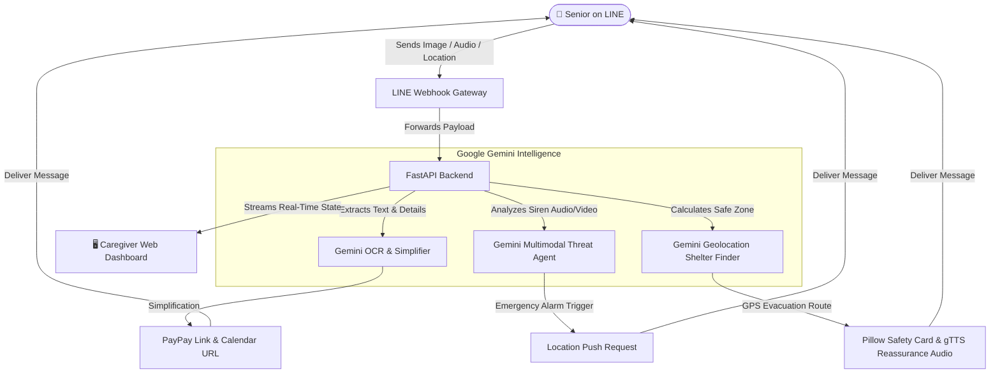

# 安心お助け (Anshin Otasuke) — AI-Powered Elder Care & Disaster Guardian

> **Google Gemini AI Hackathon Project**
> An intelligent, multimodal assistant designed to give elder seniors autonomy and their caregivers peace of mind. Leveraging Google Gemini, the LINE Messaging API, and real-time mapping, *Anshin Otasuke* serves as a daily assistant and a critical life-saving disaster guardian.

---

## 📖 Inspiration & Problem Space

In Japan's aging society, two major challenges face senior citizens living independently:
1. **Administrative Complexity:** Understanding complex official documents, paying utility or hospital bills, and managing calendar appointments.
2. **Disaster Vulnerability:** Japan is highly prone to natural disasters (earthquakes, typhoons). During emergencies (like JMA Earthquake Early Warnings), seniors face difficulties locating safe zones, understanding sirens, and communicating their safety to families.

**Anshin Otasuke (安心お助け - "Safe Helper")** bridges this gap. By utilizing **LINE** (the most popular messaging app in Japan among seniors) as the interface and **Google Gemini** as the intelligence layer, it simplifies daily administration and automates disaster evacuation.

---

## 🛠️ Architecture & Flow



---

## 🌟 Key Features

### 1. 📄 Multimodal Document Simplification & Payment
* **Gemini OCR Parsing:** Seniors can snap a photo of any complex notice, medical bill, or utility invoice.
* **Simplified Explanations:** Gemini extracts the **Issuer**, **Amount**, and **Due Date**, translating them into plain, high-readability Japanese.
* **One-Click Actions:** Generates a single-click **Google Calendar Add** button and a simulated **PayPay redirect link** to settle payments instantly.

### 2. 🚨 Automated Disaster & Threat Scanning
* **Audio & Video Threat Analysis:** Seniors can send voice memos or video uploads. Gemini scans the audio/visual tracks for emergency sirens, JMA warnings, or ambient hazards.
* **JMA Warning Integration:** Automatically intercepts Earthquake Early Warnings (EEW) to trigger safety protocols.

### 3. 🏃‍♂️ Dynamic Evacuation & Safety Cards
* **Dynamic Shelter Finder:** Upon emergency detection, the senior shares their location. Gemini identifies the closest, real-world evacuation center (park, school, or safety zone) near Tokyo.
* **Pillow Safety Cards:** Dynamically draws a visual emergency card with step-by-step walking directions for the senior.
* **gTTS Reassurance Audio:** Generates a warm, text-to-speech voice message in Japanese to calm the senior: *“Grandma, stay calm. Evacuation shelter is set to Yoyogi Park. I've sent the map to your LINE...”*

### 4. 🖥️ Caregiver Monitoring Dashboard
* Provides family members with a real-time web portal detailing the senior's **emergency status, GPS coordinates, walking route overlays, and live activity logs**.

---

## 💻 Tech Stack

| Layer | Technologies Used |
| :--- | :--- |
| **Backend Framework** | FastAPI (Python), Uvicorn |
| **AI & Multimodal Core** | Google Gemini API (`gemini-3.5-flash`), `google-generativeai` SDK |
| **User Interface** | LINE Messaging API SDK (Webhooks, Push, Reply, QuickReplies) |
| **Assets & Reassurance** | Pillow (Image generation), gTTS (Google Text-To-Speech) |
| **Frontend Dashboard** | HTML5, TailwindCSS, JavaScript (Leaflet.js/Google Maps, EventSource SSE) |
| **Deployment / Infra** | Docker, Shell scripting (`deploy.sh`), Vercel / Cloud Run |

---

## 🚀 Getting Started

### 1. Prerequisites
Ensure you have Python 3.10+ and a Gemini API Key.

### 2. Environment Variables
Create a `.env` file in the root directory:
```env
GEMINI_API_KEY=your_google_gemini_api_key
LINE_CHANNEL_SECRET=your_line_bot_channel_secret
LINE_CHANNEL_ACCESS_TOKEN=your_line_bot_channel_access_token
```

### 3. Installation
```bash
# Clone the repository
git clone https://github.com/VatsaSatyam3/anshin-otasuke.git
cd anshin-otasuke

# Install dependencies
pip install -r requirements.txt
```

### 4. Running the Project
```bash
# Start the FastAPI server
python main.py
```
Open your browser and navigate to `http://localhost:8080` to access the **Caregiver Monitoring Dashboard**.

---

## 📦 Docker Deployment

You can build and deploy the containerized environment using the provided configurations:
```bash
# Build the Docker image
docker build -t anshin-otasuke .

# Run the container
docker run -p 8080:8080 --env-file .env anshin-otasuke
```
Alternatively, execute the local deployment script:
```bash
chmod +x deploy.sh
./deploy.sh
```
