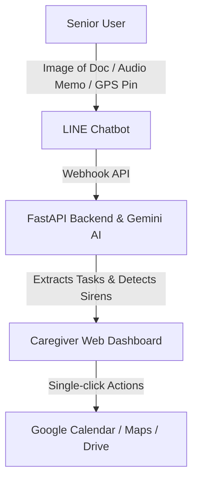

# Product Documentation: Anshin Otasuke Agent

## 1. Product Vision
The **Anshin Otasuke Agent** (Safe & Secure Elderly Guardian) is a proactive, zero-barrier assistive technology designed to bridge the digital and cognitive gap for senior citizens. It functions as a secure guardian that simplifies official administrative communication and monitors environmental safety, while providing caregivers with a real-time, premium web dashboard.

---

## 2. Key Target Audience & Problem Statement
*   **The Elderly (Seniors):** Frequently struggle with complex, jargon-heavy administrative notices (e.g., medical insurance premium increases, Shibuya ward pension notices) and can miss critical deadlines. Furthermore, they are highly vulnerable during natural disasters (earthquakes, typhoons) where public emergency broadcasts (sirens or ward announcements) may be hard to hear or interpret.
*   **Caregivers & Families:** Face continuous anxiety regarding the safety and compliance of their elderly relatives. They lack real-time visibility into their relative's safety status, current physical location, and pending official tasks.

---

## 3. Core Feature Set & User Journeys

### Feature A: Zero-Install LINE Chatbot (Elderly Interface)
*   **Administrative Document Simplifier:** The senior uploads a photo of any complex document (e.g., tax notice, medical invoice). The Gemini AI agent parses the document, extract key fields (title, due date, amount due), and explains the action required in 1-3 simple, comforting sentences in gentle English.
*   **Emergency Siren & Announcement Audio Scanner:** The senior records a short voice memo of their surroundings when they hear a warning siren or city announcement. The agent processes the audio to identify the hazard level, disaster type, and broadcast directions.
*   **Manual SOS Alerting:** Typing `"emergency"`, `"alert"`, or `"siren"` instantly puts the system into Emergency Evacuation mode.
*   **Live Location Sharing:** The senior can share their current GPS location coordinate via LINE's native share button, which dynamically updates the caregiver's route and dashboard maps.

### Feature B: Caregiver Command Center (Web Dashboard)
*   **Real-Time Status Indicators:** Visual monitoring showing the active connection status of the LINE webhook and the Cloud Run deployment.
*   **Live Interactive Map (Leaflet.js):** Normally displays the senior's last known location. Automatically updates with emergency hazard warning markers, safe shelters, and interactive evacuation paths during alerts.
*   **Extracted Tasks Panel:** Displays simplified, structured versions of uploaded notices alongside direct single-click integrations:
    *   **Add to Calendar:** Pre-fills a Google Calendar event with details and due dates.
    *   **Archive to Drive:** Simulates uploading the original document image to Google Drive for historical records.
*   **Step-by-Step Evacuation Directions:** Displays actionable walking instructions from the senior's current position to the designated shelter. Includes a button to open Google Maps walking navigation directly.
*   **Demo Simulator Panel:** Built-in triggers to simulate the document parsing and siren analysis workflows instantly for testing and presentation purposes.

---

## 4. Premium Design & Aesthetics
The caregiver dashboard is engineered to feel premium, utilizing:
*   **Color Palette:** Sleek dark-mode styling with high contrast (deep navy backgrounds, translucent glassmorphism panels, vivid primary purple `#5850ec`, LINE green `#06c755`, and emergency warning red `#ff4757`).
*   **Typography:** Modern clean sans-serif pairing (`Outfit` for headings and structure, `Noto Sans JP` for localized copy).
*   **Animations:** Smooth hover states, micro-animations (e.g., pulsing green target status indicators), slide-in notification transitions, and a pulsing full-screen modal overlay that demands caregiver attention during active sirens.
